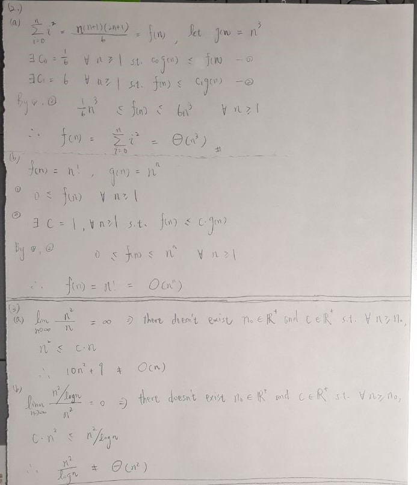

## 1.

### (a)

```c++
// a[0]: three times
int a[] = {2, 4, 0, -1, 392, 34, 2, 3, 4, 6, 10, 3, 2, 999};
cout << count(a, a + sizeof(a)/sizeof(int), a[0]) << '\n'; // 3
```

### (b)

```c++
using Mat = vector<vector<int> >;
Mat transpose(Mat &m, int Row, int Col) {
    Mat trans(Col, vector<int>(Row));
    for (int i=0; i<Row; ++i)
        for (int j=0; j<Col; ++j)
            trans[j][i] = m[i][j];
    return trans;
} 
```

## 2. && 3.



## 4.

```c++
class Complex {
    public:
        int real, img;
        Complex(): real(0), img(0) {};
        Complex(const int &_r, const int &_i): real(_r), img(_i) {};
};
```

## 5.

```c++
class Quadratic {
    public:
        int a, b, c;
        Quadratic(const int &_a, const int &_b, const int &_c) {
            a = _a;
            b = _b;
            c = _c;
        }
        Quadratic operator+(const Quadratic &q) {
            return Quadratic(a+q.a, b+q.b, c+q.c);
        }
};
```

## 6.

```c++
#ifndef _CSTRING_
#define _CSTRING_
#include <cstring>
#endif

// "Bag" is a "class template"; "Bag<int>" is a "class"
// abstract class
template<typename T>
class Bag {
    public:
        Bag() {}
        virtual ~Bag() = default;

        virtual int Size() { return tail - top; }
        virtual bool IsEmpty() { return tail == top; }
        virtual T Element() const = 0;

        virtual void Push(const T) = 0;
        virtual void Pop() = 0;

    protected:
        T *array; // stores elements
        int capacity; // the maximum number can be used to store elements, without reallocation
        int top; // array position of top element
        int tail; // array position of tail element
};

template<typename T>
class Queue: public Bag<T> {
    public:
        Queue(int queueCapacity = 10) {
            this->capacity = queueCapacity;
            this->array = new T[queueCapacity];
            this->top = this->tail = size = 0;
        }
        ~Queue() { delete[] this->array; }

        int Size() { return size; }
        bool IsEmpty() { return size == 0; }
        int Capacity() { return this->capacity; }

        // return "front" element in queue
        T Element() const {
            return this->array[this->top % this->capacity];
        }
        
        // push an element at the end of queue
        void Push(const T var) {
            this->top %= this->capacity;
            this->tail %= this->capacity;

            // cyclic
            if (this->tail == this->top) {
                // full 
                if (size == this->capacity) {
                    this->capacity = (this->capacity + 1) * 2;
                    T *new_block = new T[this->capacity];
                    memcpy(new_block, this->array + this->top, sizeof(T)*(size));
                    delete this->array;

                    this->array = new_block;
                    this->tail = size;
                    this->top = 0;
                }
            }
            this->array[(this->tail)++] = var;
            ++size;
        }
        void Pop() {
            if (IsEmpty()) return; 
            this->top %= this->capacity;
            ++(this->top);
            --size;
        }
    private:
        int size; // number of elements
};
```

## 7.

$**ABC$ 

## 8.

```c++
class Entry {
    public:
        int row, col, val;
};
class SparseMatrix {
    public:
        int size;
        Entry *entries;
        SparseMatrix(SparseMatrix &_M) {
            entries = new Entry[_M.size];
            for (int i=0; i<_M.size; ++i) {
                entries[i] = _M.entries[i];
            }
        }
};
```

* Computing time (time complexity): $O(N)$ ($N$ is the number of **non-zero** entries.)

## 9.

```c++
#include <bits/stdc++.h>
using namespace std;

void insertion_sort(int arr[], int len) {
    for (int i=1; i<len; ++i) {
        int at = arr[i], j;
        for (j=i-1; j>=0; --j) {
            if (arr[j] > at) 
                arr[j+1] = arr[j];
            else break;
        }
        arr[j+1] = at;
    }
}

int main() {
    int arr[] = {3, 2, 4, 1, 5};    
    insertion_sort(arr, 5);
    for (int i=0; i<5; ++i) 
        cout << arr[i] << ' ';
    return 0;
}
```

## 10.

```c++
bool is_palin(string &s) {
    int len = s.length();
    for (int i=0; i<len/2; ++i) {
        if (s[i] != s[len-i-1]) return false;
    }
    return true;
}
```