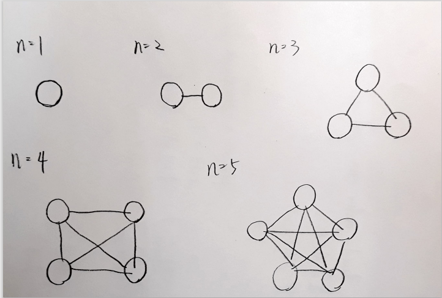

#### 1.

```c++
template<class T>
class Node {
    public:
        T data;
        Node *nxt;

        Node (): nxt(nullptr) {}
        Node (const T _data): data(_data) {}
};

template<class T>
class linkedQueue {
    public:
        linkedQueue(): _size(0) { 
            head = new Node<T>;
            tail = head;
            head->nxt = tail;
        }

        void push(const T &data) {
            Node<T> *tmp = new Node<T>(data);
            if (tail != nullptr)
                tail->nxt = tmp;
            tail = tmp;
            ++_size;
        }
        void pop() {
            if (_size == 0) return;
            Node<T> *tmp = head->nxt;
            delete head;
            head = tmp;
            --_size;
        }
        T front() const {
            return head->nxt->data;
        }
        int size() const {
            return this->_size;
        }
    private:
        int _size;
        Node<T> *head, *tail;
};

/* test
#include <iostream>
#include "linked_queue.h"
using namespace std;

int main() {
    linkedQueue<int> que;
    for (int i=0; i<5; ++i) {
        que.push(i);
    }
    cout << "size: " << que.size() << '\n';
    for (int i=0; i<5; ++i) {
        cout << que.front() << ' ';
        que.pop();
    }
    return 0;
}
*/
```

#### 2. 

```c++
void SwapTree(BST *node) {
    if (node == nullptr) return;
    SwapTree(node->lch);
    SwapTree(node->rch);
    swap(node->lch, node->rch);
}
```

#### 3.


#### 4.

Suppose binary tree $T$ has $n$ nodes.
Let the preorder sequence of $T$ be $P=P_1P_2...P_n$ and the inorder sequence of it be $I=I_1I_2...I_n$.
Let subsequence of $I$ be $I'$.

First, by definition, the root of $T$ is $P_1$, and find $j$ such that $I_j = P_i$.
The left subsequence of $I$: $I_l=I_1I_2...I_{j-1}$ is the left subtree of $T$, and $I_r=I_{j+1}I_{j+2}...I_n$ is the right subtree of $T$. (definition of inorder)
If $I_l$ is not empty, then $P_2$ is the root of $T's$ left subtree; if it is empty, then $P_2$ is that of $T's$ right subtree. (definition of preorder)
While incrementing $i$, recursively find $j$ such that $I'_j=P_i$, and divide $I'$ into subsequences, until $i=n$.
A binary tree is then constructed.
Since all procedures all carried out by definition, the constructed binary tree is unique, and it is $T$.

#### 5.

Suppose there are $E$ edges.
Each edge is connected to exactly two vertices, which contributed to **2** degrees to the sum of degree of vertices in an undirected graph.

$\because$ there are $E$ edges
$\therefore$ the sum of degree of vertices is $2E$ 

#### 6.



Suppose there are $n$ vertices in a complete undirected graph.

$\because$ each pair of distinct vertices is connected by an edge
$\therefore$ the number of edges is ${n \choose 2}={n(n-1)\over2}$ 

#### 7.

```c++
const int V = 100; // number of vertices
vector<int> G[V]; // adjacency list
bool vis[V]; // true if visited 

void bfs(int st) {
    queue<int> que;
    que.push(st);
    fill(vis, vis+V, 0);

    while (que.size()) {
        auto v = que.front(); que.pop();
        vis[v] = true;
        cout << v << ' ';

        for (auto u: G[v]) {
            if (vis[u]) continue;
            que.push(u);
        } 
    }
}
```

#### 8.

Suppose there are $n$ vertices, numbered from $1$ to $n$, in a complete graph $G$.
Let $P_i$ denotes a permutation of $\{1, 2, ..., n\}$. 
Since $G$ is a complete graph, every pair of vertices are guaranteed to be connected. Hence, $P_i$ can be interpreted as a traversing order of a spanning tree of $G$. 
However, $(1, 2,...,n-1, n) = (n, n-1,...2, 1)$ in terms of spanning tree, which means traversing the same tree from one end or from the other end.
Therefore, there are at least $S={n! \over  2}$ distinct spaning trees which can be derived from $G$. ($\forall n \geq 2$)
For $n=1$, define that $S=1$.

$\because n! > 2^n \Rightarrow {n!\over 2} > 2^{n-1}$ 
$\therefore S={n! \over 2} \geq 2^{n-1}-1$ 

#### 9.

```c++
#include <queue>
#include <vector>
#define QUEUE
#define VECTOR

// no error detection
class TopoIterator {
    public:
        // number of vertices and adjacency list of graph
        TopoIterator(int _v, std::vector<int> _graph[]) {
            iterator = 0;
            V = _v;
            G.resize(V);
            for (int i=0; i<V; ++i) {
                G[i] = _graph[i];
            }
            sort();
        }

        void sort() {
            std::queue<int> que;
            std::vector<int> indeg(V);

            for (auto &vec: G) {
                for (auto &u: vec) {
                    ++indeg[u];
                }
            }

            for (int u=0; u<V; ++u) {
                if (indeg[u] == 0) {
                    que.push(u);
                    sorted_seq.push_back(u);
                }
            }

            while (que.size()) {
                int v = que.front(); que.pop();
                for (auto &u: G[v]) {
                    if (--indeg[u] == 0) {
                        que.push(u);
                        sorted_seq.push_back(u);
                    }
                }
            }
        }
        // return the id of current node
        int at() const  {
            return sorted_seq[iterator];
        }
        // move forward for one step (cyclic)
        void advance() {
            (++iterator) %= V;
        }
        // return the whole sorted sequence
        std::vector<int> get_all() const {
            return sorted_seq;
        }

    private:
        int V, iterator;
        std::vector<std::vector<int> > G;
        std::vector<int> sorted_seq;
};
```

#### 10.

1) Since there is a **negative-weighted** edge,  distance form $0$ to $1$ is actually shorter if path $0 \rightarrow2 \rightarrow 1$ is taken. However, $ShortestPath$ will take $0 \rightarrow 1$ directly. Hence it  will not work.
2) $0 \rightarrow 2 \rightarrow 1 \rightarrow 3 \rightarrow 4 \rightarrow 6$ 
